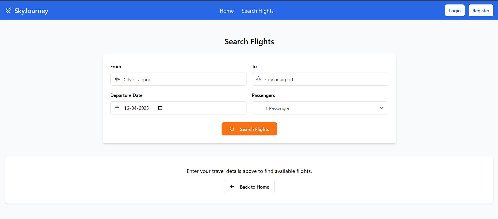

# ✈️ SkyJourney – Flight Booking Website

SkyJourney is a full-stack web application built with the **MERN stack (MongoDB, Express.js, React, Node.js)**. It allows users to **search for flights, view flight details, book tickets**, and **manage their bookings**.

---

## 📸 Screenshots

### Home Page


### Search Flights


### Login Page


---

## 🚀 Features

- User registration and login
- Search for available flights by location and date
- View flight details
- Book flights (with passenger and seat info)
- View and cancel bookings

---

## 🛠️ Tech Stack

| Layer         | Technology           |
|---------------|----------------------|
| Frontend      | React.js             |
| Backend       | Node.js, Express.js |
| Database      | MongoDB              |

---

## ⚙️ Setup Instructions

### 1. Clone the repository

```bash
git clone https://github.com/your-username/skyjourney.git
cd skyjourney
```

### 2. Install server dependencies

```bash
cd server
npm install
```

### 3. Install client dependencies

```bash
cd ../client
npm install
```

### 4. Set up environment variables
Create a .env file in the server/ directory:
PORT=5000
MONGO_URI=your_mongodb_connection_string
JWT_SECRET=your_jwt_secret_key

### 5. Run the app
Start the backend
```bash
cd server
npm run dev
```
Start the frontend
```bash
cd ../client
npm start
```
